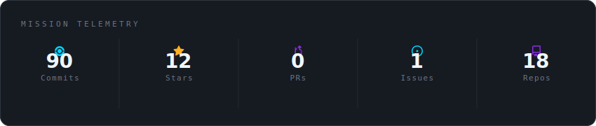

  

  

 

  

 

<h3 align="center">
  
  Bem-vindo ao meu universo de código!
</h3>

  Atualmente focado em <b>API REST</b>, <b>Spring Boot</b> e <b>Data Science</b>.

 

  

 

  

 

  
  &nbsp;
  
  &nbsp;
  

 

  

